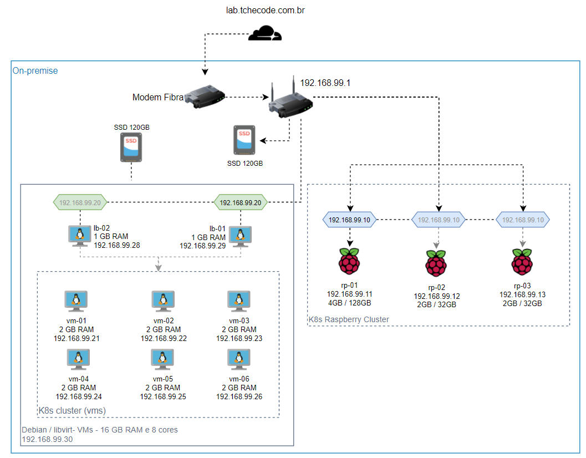

# Laboratório pessoal 

%3D2.11.5-red?style=for-the-badge&logo=ansible&logoColor=white" alt="Ansible">
%3D1.0.7-6a01eb?style=for-the-badge&logo=terraform&logoColor=white" alt="Terraform">
%3D1.7.5-blue?style=for-the-badge&logo=packer&logoColor=white" alt="Packer">

Este repositório reúne as aplicações e configurações aplicadas no meu laboratório pessoal. 
Utilizo o lab para testar tecnologias e instalar aplicações de uso diário. 

A ideia é configurar alguns hosts na nuvem e ter as minhas raspberry's locais rodando algumas aplicações. 

Apesar deste repositório não ter o intuíto de ser replicável, as partes documentadas visam trazer um exemplar de aplicabilidade de diversos recursos que poderão ser registrados em outros repositórios (Roles do ansible, Helm charts, módulos de Terraform, etc). 

## Roadmap:

Utilizarei o projeto público abaixo para organizar o roadmap de estudos e manter os reviews de recursos que foram testados ou estão no ambiente. 

https://github.com/users/lucaslehnen/projects/3/views/1

*** Se você quiser replicar o ambiente em máquinas virtuais, deve funcionar também, pois estarei testando nas arquiteturas arm64 e amd64.

## Infraestrutura atual:

Aqui especificarei de maneira macro o que estou usando no ambiente: 
```
[X] 2 Raspberry 4 Model B - 2 GB RAM c/ MicroSD de 32 GB
[X] 1 Raspberry 4 Model B - 4 GB RAM c/ MicroSD de 128 GB
[X] 1 Switch 5 Portas
[X] 1 Roteador com USB para driver externo de armazenamento
[X] 1 SSD's Evo 850 120GB
[X] 1 PC i7 4790K / 16GB RAM / 120 SSD (expansível)
```
### Desenho do ambiente



No meu desktop, eu instalei o Debian, e configurei máquinas virtuais nele para a instalação do Cluster Kubernetes e dos load balancers. 
Como as vezes uso este computador para trabalhar ou jogar, estas máquinas virtuais não ficarão sempre online.

### Documentação do ambiente

1. Instalação das ferramentas e preparação [[Ler...]](docs/1-install.md)
2. Configuração de chave SSH [[Ler...]](docs/2-ssh.md)
3. Cluster K8s com vms no libvirt     
    - Playbook do Ansible para instalação e configuração do host libvirt [[Ler...]](docs/3-libvirt.md)
    - Geração das imagens com Packer
    - Instalação do K8s com Ansible (Provisioner)
    - Provisionamento das VMs com Terraform    
- Cluster k8s nas raspberrys
    - Distribuições escolhidas e pré-requisitos para conexão do Ansible
    - Configuração das distribuições Linux
    - Playbook do Ansible para instalação e configuração do Cluster K8s

## Como iniciar

Montei um arquivo `Makefile` com os comandos prontos para a gestão do ambiente. A partir dele as demais ferramentas como o Terraform, Packer e Ansible são acionadas. Obviamente, é necessário ter as ferramentas instaladas na máquina para que os comandos abaixo funcionem. `install`, `up` e `down` são os comandos principais, sendo que os demais já estão embutidos neles.

 - `make install` <br>
    Faz a inicialização das ferramentas de IaC e downloads necessário na maquina local, como as collections e roles utilizadas no Ansible. ** Não instala as ferramentas, só prepara-as para a execução. A instalação deve ser seguida pela documentação das mesmas e com o auxílio [desta documentação](./docs/1-install.md);

- `make up` <br>
    Roda todos os comandos na ordem adequada para subir o ambiente COMPLETAMENTE.

 - `make down` <br>
    Desfaz as instalações realizadas no up. 

 - `make vmserver`<br>
    Preparar o servidor de VMs;

## Contribuindo

Apesar deste repositório ser voltado para o meu cenário e ambiente, muitas configurações podem ser reaproveitadas e adaptadas aos mais diversos cenários. Portanto, contribuições são muito bem vindas, basta fazer um fork e abrir um PR. 
