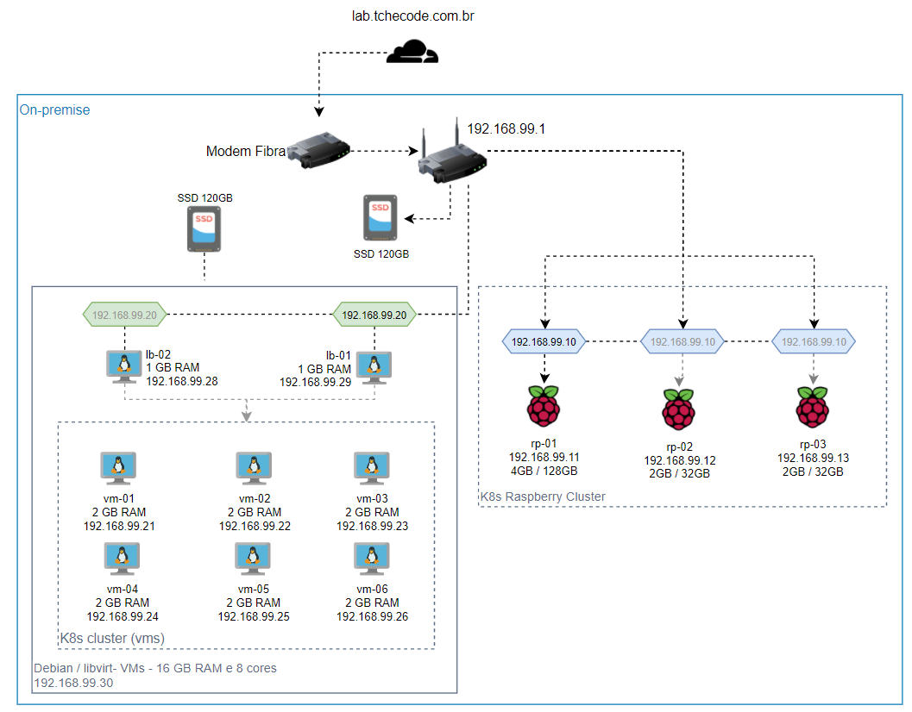

# Laboratório pessoal 


[](https://wakatime.com/badge/github/lucaslehnen/homelab)

Este repositório reúne as aplicações e configurações aplicadas no meu laboratório pessoal. 
Utilizo o lab para testar tecnologias e instalar aplicações de uso diário. 

A ideia é configurar alguns hosts na nuvem e ter as minhas raspberry's locais rodando algumas aplicações. 

Apesar deste repositório não ter o intuíto de ser replicável, as partes documentadas visam trazer um exemplar de aplicabilidade de diversos recursos que poderão ser registrados em outros repositórios (Roles do ansible, Helm charts, módulos de Terraform, etc). 

## Infraestrutura atual:

Aqui especificarei de maneira macro o que estou usando no ambiente: 



```
- 2 Raspberry 4 Model B - 2 GB RAM c/ MicroSD de 32 GB
- 1 Raspberry 4 Model B - 4 GB RAM c/ MicroSD de 128 GB
- 1 Switch 5 Portas
- 1 Roteador com USB para driver externo de armazenamento
- 2 SSD's Evo 850 120GB
- 120 GB HDD
- 1 PC i7 4790K / 16GB RAM 
```
### Documentação do ambiente

0. Motivadores e objetivos [...Ler...](docs/objetivos.md)
1. Configurações [...Ler...](docs/config.md)
2. Cluster K8s no meu desktop:
    - Instalação e configuração [...Ler...](docs/desktop.md)
    - Templates Packer [...Ler...](docs/pkr-k8s.md)
    - Instalação do K8s com Ansible 
    - Provisionamento das VMs com Terraform    
3. Cluster k8s nas Raspberrys
    - Distribuições escolhidas e pré-requisitos para conexão do Ansible
    - Configuração das distribuições Linux
    - Playbook do Ansible para instalação e configuração do Cluster K8s
4. Ambiente na cloud
    - OCI        
        - Configuração da conta
        - Recursos utilizados
        - Cluster Nomad
    - AWS
        - Configuração da conta
        - Recursos utilizados
    - Azure
        - Configuração da conta
        - Recursos utilizados
    - GCP
        - Configuração da conta
        - Recursos utilizados
    
5. Documentação complementar
    - Configuração de sudo  [...Ler...](docs/sudo.md)    
    - Configuração do SSH  [...Ler...](docs/ssh.md)

## Como iniciar

Inicialmente, precisamos apenas do `make`. Se não tens em sua distro, vamos garantir que o mesmo esteja disponível: 

```
$ apt install build-essential
```

Além disso, as máquinas alvo já devem estar com o acesso SSH configurado. Consultar a documentação para detalhes.

O Ansible, Terraform e Packer também são requeridos. Informações de como instalá-los estão [aqui](doc/install.md).

A partir do arquivo `Makefile`, as demais ferramentas como o Terraform, Packer, Ansible e scripts são acionadas. `install`, `up` e `down` são os comandos principais, sendo que os demais já estão embutidos neles.

 - `make install` <br>
    É a primeira coisa a se fazer, provavelmente você só vai fazê-lo uma vez.    
    Faz a instalação e inicialização das ferramentas de IaC, downloads necessários na maquina local, como as collections e roles utilizadas no Ansible.;

- `make up` <br>
    Roda todos os comandos na ordem adequada para subir o ambiente COMPLETAMENTE.

 - `make down` <br>
    Desfaz as instalações realizadas no up. 

Alguns prefixos após os comandos up e down podem acionar apenas parte da automação, como por exemplo o `make up-esxi`, que irá instalar apenas as máquinas virtuais do ESXi.

A automação foi escrita para que os comandos sejam idempotentes, ou seja, não tem problema fazer a chamada mais de uma vez.

## Configurando o ambiente

As configurações estão centralizadas no arquivo `env.yml`. Disponibilizei um arquivo sample junto no repositório para auxiliar. 

Mais detalhes sobre as opções a serem configuradas podem ser vistas [aqui](docs/config.md).
## Contribuindo

Apesar deste repositório ser voltado para o meu cenário e ambiente, muitas configurações podem ser reaproveitadas e adaptadas aos mais diversos cenários. Portanto, contribuições são muito bem vindas, basta fazer um fork e abrir um PR. 
