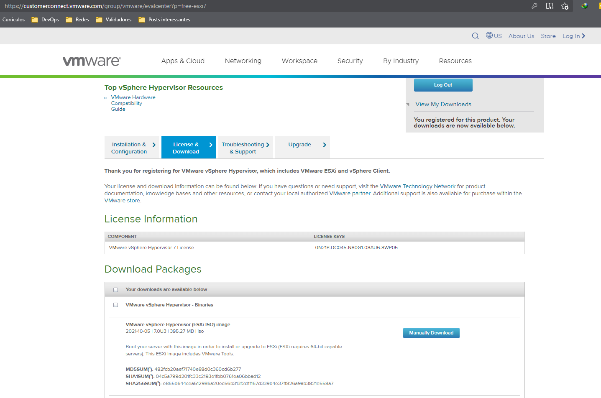

[Voltar à raiz](../README.md)

# Servidor de VMs com ESXI

Esta seção demonstra como foi realizada a configuração do servidor de máquinas virtuais com ESXI. 

Possuo um desktop Z97X-SLI de 16GB de RAM e processador i7 4790K, e pluguei um SSD de 120GB via usb para dedicar ao sistema operacional. 

Esse não é um hardware para servidor e as minhas tentativas de instalar o virtualizador da VMWare diratamente no SSD falharam. 
Contudo, consegui colocá-lo para rodar dentro do Qemu, outro  sistema de virtualização. 

Portanto, a gambiarra ficou com o Debian 11 no SSD e dentro dele uma VM emulada com o Qemu, onde instalei o ESXI. Claro que não é um ambiente para produção e a performance deixa a desejar, mas é suficiente para os experimentos com Packer e Terraform, meu principal objetivo. 

## Preparando o Debian com o libvirt/qemu/kvm

O Debian 11 foi uma escolha pessoal, ele vem com poucos serviços de largada, então achei interessante para economizar RAM para a máquina virtual, mas a princípio pode ser qualquer distro. Os passos aqui descritos serão os aplicados para o Debian.

Algumas coisas que já fiz no processo de instalação dele ou no pós-instalação:
 - Desmarquei todos os pacotes extras na instalação, deixei apenas o servidor ssh;
 - Defini o usuário `lucas` com a senha que queria;
 - Setei o IP para estático `192.168.99.30`;
 - Criei previamente um par de chaves RSA localmente em `~/.ssh/homelab`. Os passos para registrar a chave e permitir o acesso sem senha estão [aqui](./2-ssh.md).
 - Ajustei os privilégios de escalação para root, conforme especificado [aqui](./1-install.md#como-escalar-para-root).

Então, montei um playbook Ansible para a instalação do libvirt e qemu, preparando a VM para o ESXI. Na verdade são dois playbooks, um que monta a estrutura (`site.yml`) e um que desmonta (`reset.yml`). Eles fazem as seguintes alterações: 
- Instala os pacotes do libvirt;
- Instala pacotes de utilitários para administração de vms no qemu;
- Configura uma rede bridge para uso nas vms (assim consigo usar a minha rede LAN);

Separei alguns comandos úteis para a administração da vm do libvirt [aqui](./4-libvirt-commands.md). 

## Instalando o ESXI

Fiz o download da iso do ESXI 7 update 3 no [site da VMWare](https://customerconnect.vmware.com/group/vmware/evalcenter?p=free-esxi7).

É necessário uma conta.



### Customizando a ISO

A forma que achei para automatizar 100% a instalação, exige a modificação da ISO padrão, adicionando o arquivo de *kickstart* dentro da mesma. Se não quiser fazer este passo, pode apenas adicionar o arquivo durante o boot. 

No linux/wsl, instalar o pacote para possuirmos o comando de geração de iso:

```
sudo apt install 
```


Copiei o arquivo ISO para o servidor com o Qemu:

```
 scp VMware-VMvisor-Installer-7.0U3-18644231.x86_64.iso lucas@192.168.99.30:/home/lucas/esxi7.iso
```

Dentro do servidor com o Qemu, inicializo a VM:

```
virt-install \
  --name=esxi7 \
  --cpu host-passthrough \
  --ram 14848 \
  --vcpus=8 \
  --os-type linux --os-variant=generic \
  --cdrom /home/lucas/esxi7.iso \
  --network bridge=virbr0,model=e1000e \
  --graphics vnc,listen=0.0.0.0 --video qxl \
  --disk pool=lucas,size=20,bus=sata,format=qcow2 \
  --disk pool=lucas,size=60,bus=sata,format=qcow2 \
  --boot cdrom,hd --noautoconsole --force \
  --feature kvm_hidden=on --machine q35  
```

```
virt-install \
  --name=esxi7 \
  --cpu host-passthrough \
  --ram 14336 \
  --vcpus=8 \
  --os-type linux --os-variant=generic \
  --cdrom /home/lucas/esxi7.iso \
  --network bridge=virbr0,model=e1000e \
  --graphics vnc,listen=0.0.0.0 --video qxl \
  --disk pool=lucas,size=20,bus=sata,format=qcow2 \
  --disk pool=lucas,size=60,bus=sata,format=qcow2 \
  --boot cdrom,hd --noautoconsole --force \
  --feature kvm_hidden=on --machine q35 \
  --pxe
```

Fonte:

https://www.grottedubarbu.fr/nested-virtualization-esxi-kvm/


---
[Voltar à raiz](../README.md)