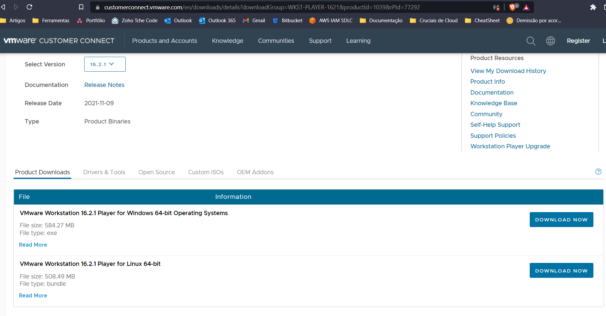

[Voltar à raiz](../README.md)

## Configuração do servidor Desktop:
### Preparando o Debian 

O Debian 11 foi uma escolha pessoal, ele vem com poucos serviços de largada, então achei interessante para economizar RAM para a máquina virtual, mas a princípio pode ser qualquer distro. Os passos aqui descritos serão os aplicados para o Debian, sendo que no futuro o playbook pode ser aprimorado para outras distros.

Coloquei a interface LXDE nele, pois como resolvi fazer tudo manualmente, quero uma interface gráfica para configurar o Player. O LXDE é uma interface leve, então ficou ocupando uns 300MB de RAM apenas, sobrando mais para a virtualização. 

Algumas coisas que já fiz no processo de instalação do Debian ou no pós-instalação (manual):
 - Desmarquei todos os pacotes extras na instalação, deixei apenas o servidor ssh e o LXDE;
 - Defini o usuário `lucas` com a senha que queria;
 - Setei o IP para estático `192.168.99.30` (removi o pacote connman que veio no lxde, para deixar a gestão pelo arquivo );
 - Registrei a chave SSH que eu havia criado na minha máquina. Detalhes [aqui](./ssh.md).
 - Ajustei os privilégios de escalação para root, conforme especificado [aqui](./sudo.md).  

Com isso, já posso executar o Ansible. 

## Virtualizadores

Abaixo as opções de virtualizadores configurados para executar as máquinas. 

### Qemu / Libvirt

#Todo

### VMWare

** Este virtualizador não será utilizado por hora, devido a falta de ferramentas integradas para o Terraform e Packer. 

Dentro do Debian, a opção com VMWare, seria o Workstation. Ai dentro dele, poderia ser colocado o ESXi para testes futuros. 

 > Tentei utilizar o VMWare Player, mas o bundle dele não tem os utilitários necessários para o Packer e Terraform. 

O principal "problema" do Workstation é a necessidade de licença, mas futuramente pretendo ver esse ponto. 

Estou montando uma collection do Ansible para instalar e operar as ferramentas do VMWare. Então a ideia é chamá-la aqui neste playbook. 
Mais detalhes no repositório da collection:  https://github.com/lucaslehnen/tchecode.vmware

Peguei o link do arquivo `.bundle` no site: https://www.vmware.com/products/workstation-player.html

---

Próximo Tópico: [Configuração das raspberrys](raspberrys.md)

---
[Voltar à raiz](../README.md)