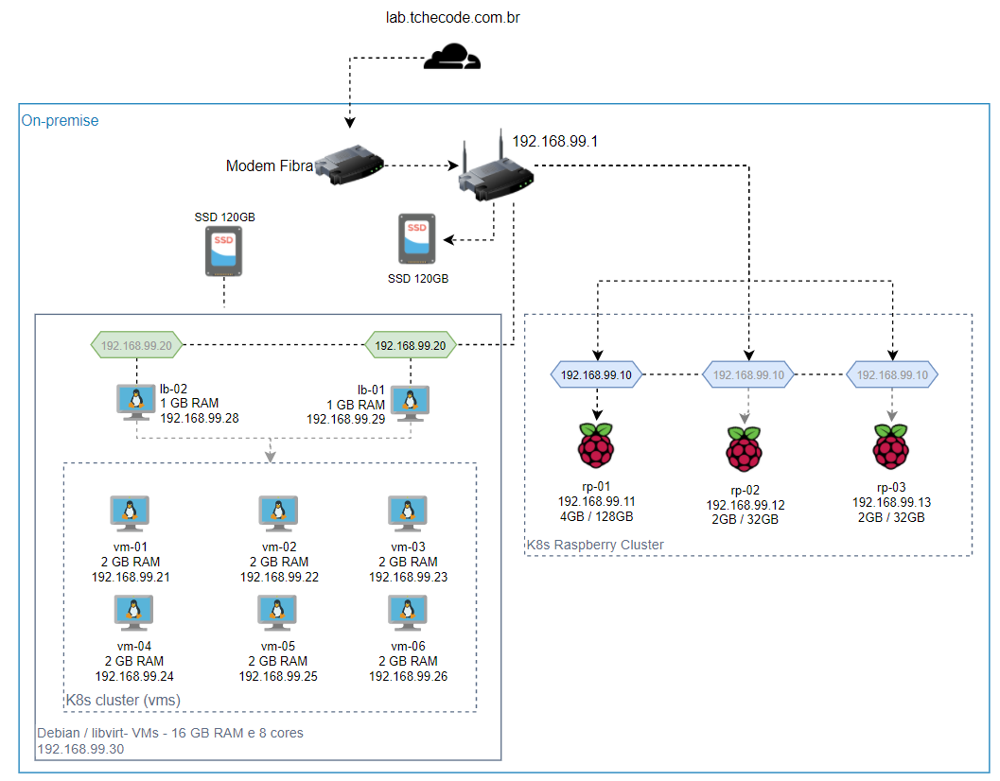

[Voltar à raiz](../README.md)

## Infraestrutura local:

Aqui especificarei de maneira macro o que estou usando no ambiente: 

```
- 2 Raspberry 4 Model B - 2 GB RAM c/ MicroSD de 32 GB
- 1 Raspberry 4 Model B - 4 GB RAM c/ MicroSD de 128 GB
- 1 HD 1TB via USB
- 1 Switch 5 Portas
- 1 Roteador com USB para driver externo de armazenamento
- 2 SSD's Evo 850 120GB
- 120 GB HDD
- 1 PC i7 4790K / 32GB RAM (aka `vmserver`)
- 1 Note Dell 16GB ( meu notebook )
```



## Virtualizador no Desktop

Este computador já tinha um dual boot com Windows e Ubuntu. O Windows utilizo para jogos no tempo livre e o Ubuntu para trabalhar quando necessito de mais poder computacional.

Além dos Ubuntu e Windows, eu pluguei um dos SSDs via USB e instalei o Debian 11 nele. 

> Como esse não é um hardware para servidor, as tentativas de instalar o ESXi diretamente no SSD falharam por falta de compatibilidade. Por isso o Debian no SSD. E Dentro dele, duas opções: VMWare Workstation e QEmu/Libvirt. Dentro do VMWare Workstation, posso colocar o ESXi para laboratório. 

Hardware disponível no desktop:
  - Motherboard Z97X-SLI
  - 32GB de RAM DDR3
  - Processador i7 4790K
  - SSD de 120GB ( via usb para dedicar ao sistema operacional ).

Outros recursos não aproveitados no projeto:
  - GPU GTX 1080 TI  
  - 6TB de HDD
  - 1TB de SSD 

Com um virtualizador rodando, eu posso utilizar plugins do Packer para criação de golden images e usar o Terraform para provisionamento de máquinas virtuais, de forma bem semelhante à nuvem. 

Claro que não é um ambiente para produção e a performance deixa a desejar, mas é suficiente para estes experimentos com Packer, Terraform, Kubernetes e as outras ferramentas que quero colocar, reduzindo o custo de nuvem. 

Mais informações: [Configuração do Desktop](desktop.md)

## Raspberrys

As Raspberrys gastam menos luz que o meu Desktop, portanto pretendo deixar algumas coisas rodando dentro de um cluster Kubernetes. 

A ideia inicial foi colocar distros distintas de Linux, pegando principalmente as duas grandes famílias RHEL e Debian para exercitar os pormenores de cada distro. 

```
Nome   : rp-01
SO     : Debian 11
RAM    : 4GB
SDCard : 128GB

Nome   : rp-02
SO     : CentOS Stream
RAM    : 2GB
SDCard : 32GB

Nome   : rp-03
SO     : Ubuntu 21.10
RAM    : 2GB
SDCard : 32GB
``` 

Mais informações: [Configuração das Raspberrys](raspberrys.md)

---

Próximo Tópico: [Configuração do Desktop](desktop.md)

---
[Voltar à raiz](../README.md)